# 🏥 Healthcare Readmission Prediction

## 📊 Project Overview

An end-to-end healthcare data analytics and machine learning project focused on predicting 30-day hospital readmissions for diabetes patients using the Diabetes 130-US Hospitals dataset.

This project includes data preprocessing, exploratory data analysis, feature engineering, visualization, machine learning model building, model evaluation, risk stratification, and business impact analysis.

---

## 🎯 Business Objectives

1. Predict 30-day hospital readmission risk for diabetes patients
2. Identify key clinical and demographic factors influencing readmission
3. Analyze patient demographics, diagnosis, and hospital utilization patterns
4. Segment patients into low, medium, high, and very high-risk groups
5. Support hospitals in reducing readmission rates and improving patient care
6. Estimate potential cost savings through targeted interventions

---

## 📌 Dataset

- **Dataset:** Diabetes 130-US Hospitals
- **Period:** 1999–2008
- **Total Records:** 101,766
- **Target Variable:** 30-day hospital readmission
- **Patient Group:** Diabetes patients
- **Analysis Type:** End-to-end healthcare analytics pipeline

---

## 📁 Project Structure

```text
healthcare-readmission-prediction/
│
├── healthcare_readmission_prediction.py
├── healthcare_readmissions.csv
├── EXECUTIVE_SUMMARY_HEALTHCARE.txt
├── README.md
├── requirements.txt
│
└── visualizations/
    ├── 01_target_distribution.png
    ├── 02_numeric_distributions.png
    ├── 03_categorical_distributions.png
    ├── 04_numeric_vs_readmission.png
    ├── 05_categorical_vs_readmission.png
    ├── 06_correlation_matrix.png
    ├── 07_model_comparison.png
    ├── 08_confusion_matrices.png
    ├── 09_feature_importance.png
    ├── 10_probability_distribution.png
    ├── 11_risk_stratification.png
    └── 12_FINAL_DASHBOARD.png
```

---

## 📊 Key Visualizations

### Target Distribution
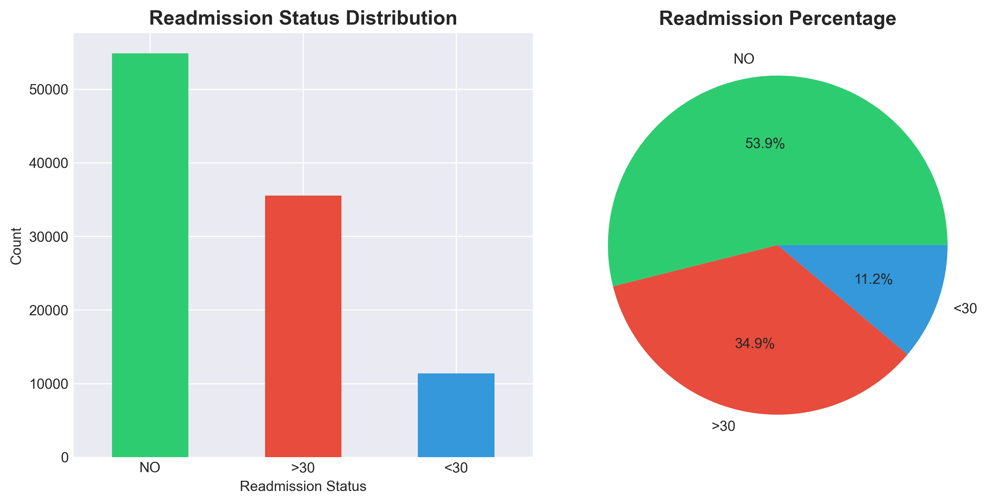

### Numeric Distributions
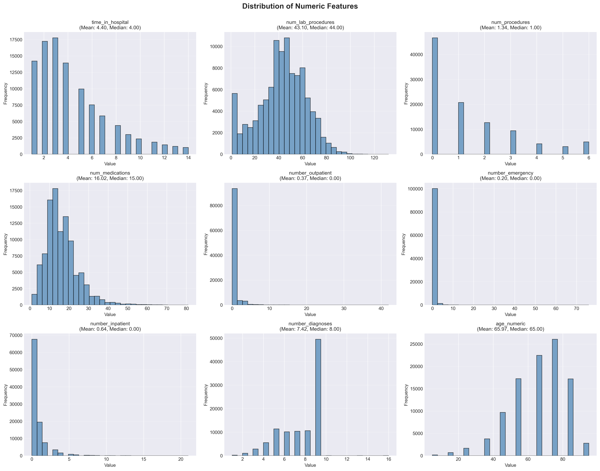

### Categorical Distributions
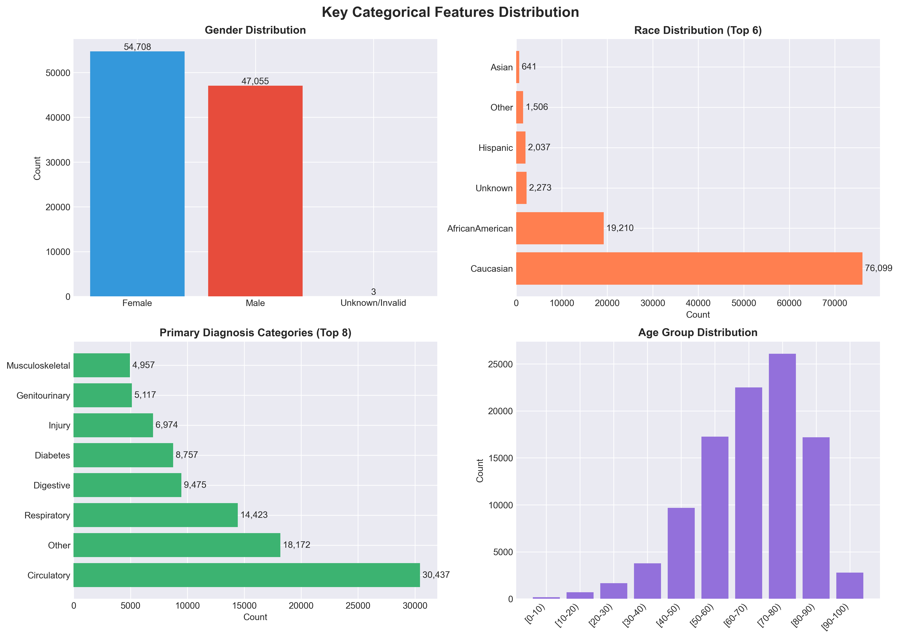

### Numeric Features vs Readmission
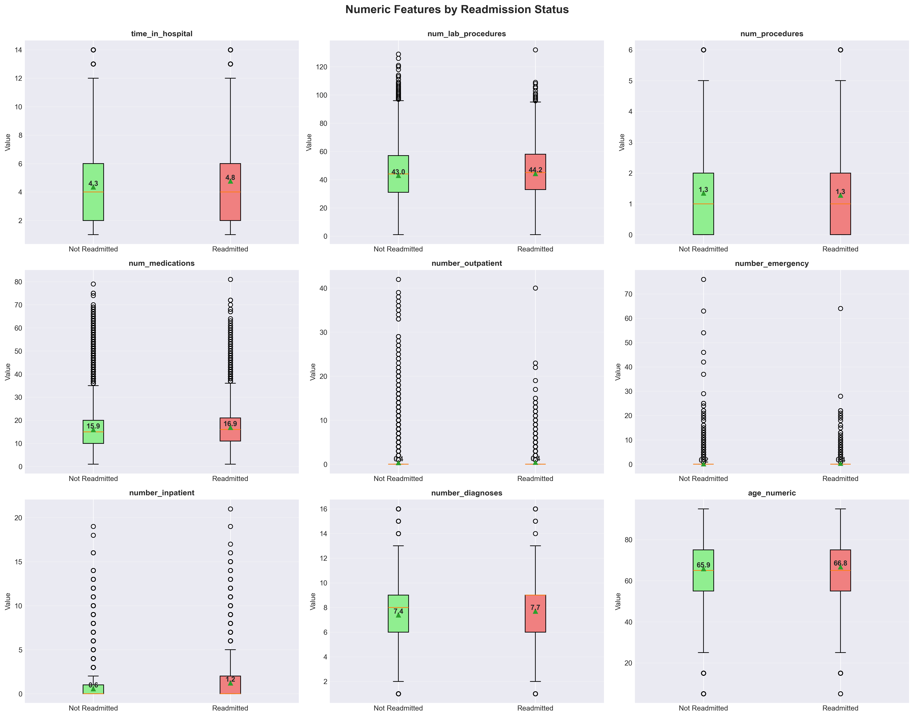

### Categorical Features vs Readmission
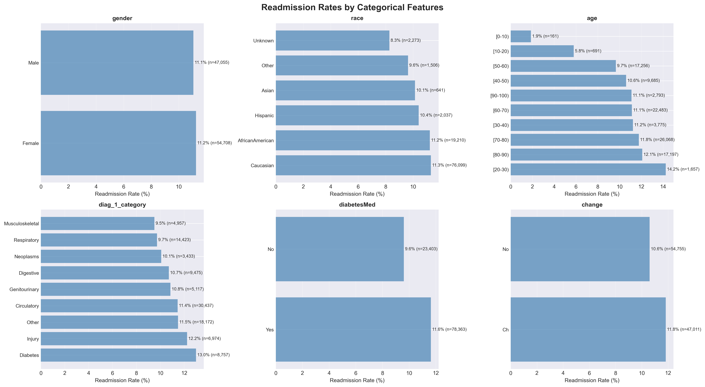

### Correlation Matrix
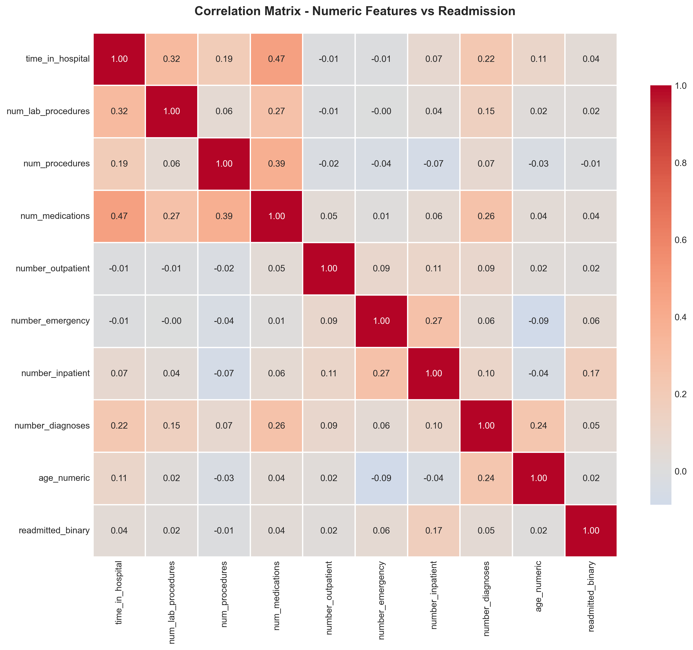

### Model Comparison
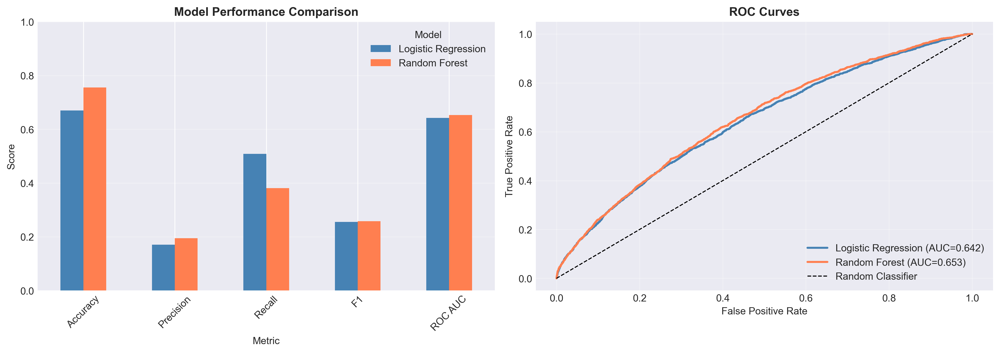

### Confusion Matrices
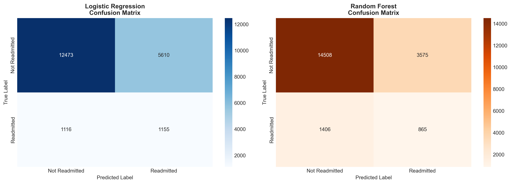

### Feature Importance
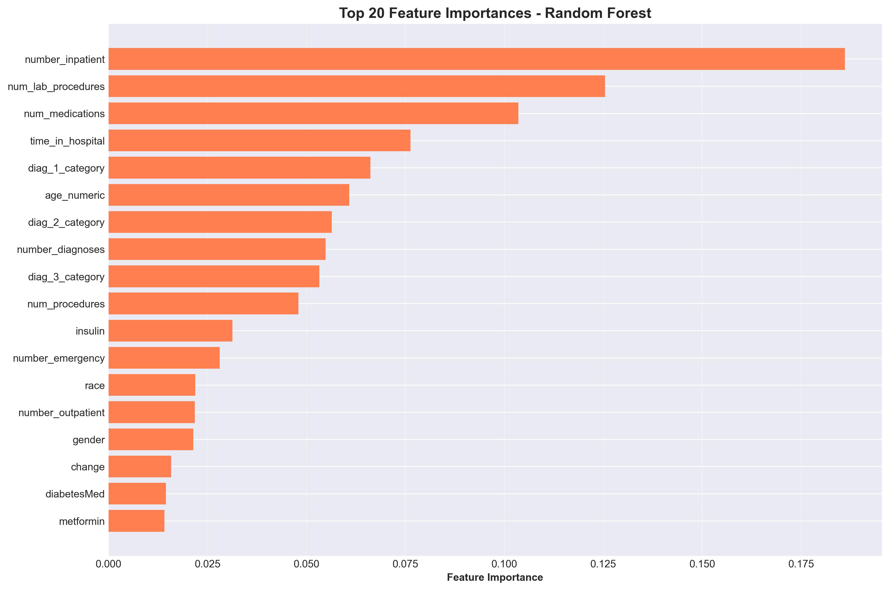

### Probability Distribution
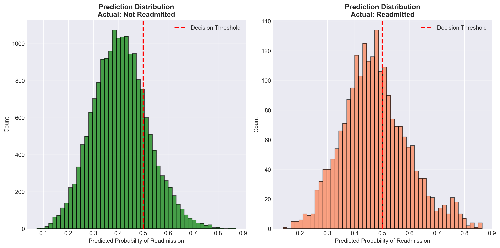

### Risk Stratification
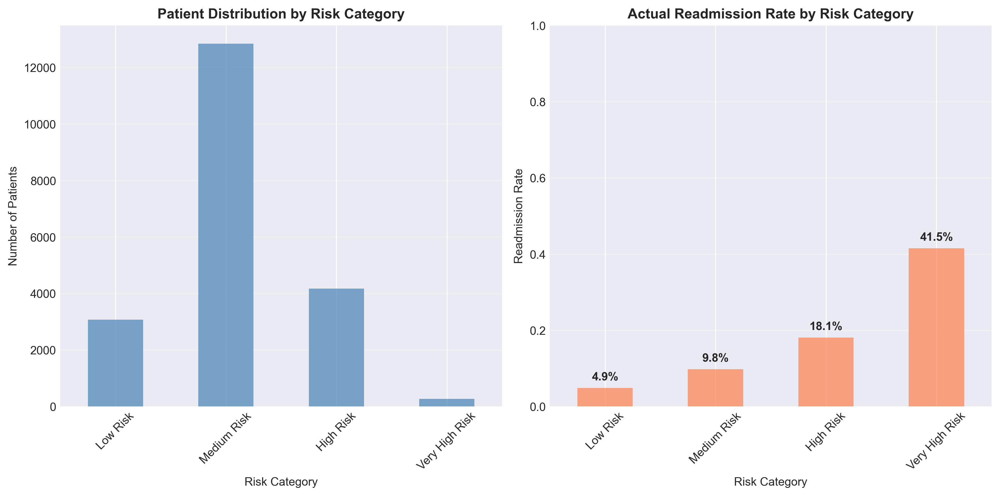

### Final Dashboard
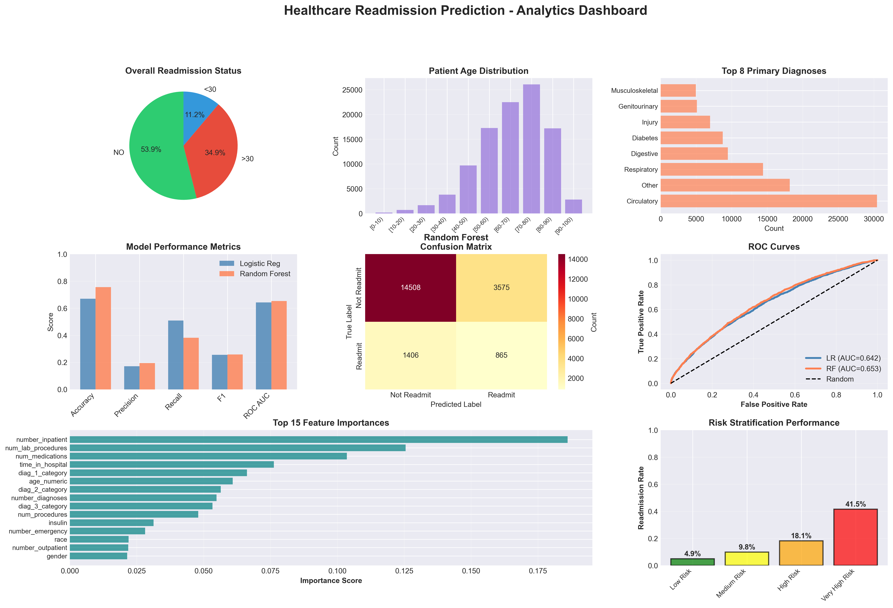

---

## 📈 Key Findings

### Readmission Statistics

- Overall 30-day readmission rate: **11.16%**
- Total readmissions in dataset: **11,357**
- Patient population is primarily elderly
- Median patient age: **65 years**

### Risk Factors Identified

- Prior inpatient admissions strongly influence readmission risk
- Emergency department utilization is associated with higher readmission probability
- Circulatory and respiratory conditions show elevated readmission risk
- Elderly patients aged 70+ have higher readmission rates

---

## 🤖 Model Performance

The best-performing model was **Random Forest**.

| Metric | Value |
|---|---:|
| Accuracy | 75.53% |
| Precision | 19.48% |
| Recall | 38.09% |
| F1 Score | 25.78% |
| ROC AUC | 0.6529 |

---

## 🧾 Confusion Matrix Analysis

| Prediction Result | Count | Meaning |
|---|---:|---|
| True Negatives | 14,508 | Correct low-risk predictions |
| False Positives | 3,575 | Unnecessary interventions |
| False Negatives | 1,406 | Missed readmissions |
| True Positives | 865 | Correct high-risk predictions |

The model captures **38.1%** of actual readmissions.

---

## 🏥 Patient Risk Stratification

| Risk Group | Patients | Readmission Rate |
|---|---:|---:|
| Low Risk | 3,070 | 4.9% |
| Medium Risk | 12,844 | 9.8% |
| High Risk | 4,175 | 18.1% |
| Very High Risk | 265 | 41.5% |

---

## 💰 Business Impact Analysis

### Assumptions

- Average readmission cost: **$15,000**
- Intervention cost per patient: **$1,000**
- Intervention effectiveness: **70%**

### Projected Outcomes

| Metric | Value |
|---|---:|
| Patients requiring intervention | 4,440 |
| Estimated readmissions prevented | 606 |
| Total intervention cost | $4,440,000 |
| Potential cost savings | $9,082,500 |
| Net benefit | $4,642,500 |

---

## 🔬 Analytics Techniques Implemented

### Data Analysis

- Data cleaning
- Missing value handling
- Exploratory Data Analysis
- Univariate analysis
- Bivariate analysis
- Correlation analysis
- Feature engineering

### Machine Learning

- Random Forest Classification
- Train-test split
- Model comparison
- Confusion matrix analysis
- Precision, recall, F1-score, and ROC AUC evaluation
- Feature importance analysis

### Healthcare Analytics

- Readmission risk analysis
- Patient demographic analysis
- Diagnosis-based readmission analysis
- Hospital utilization analysis
- Risk stratification
- Business impact estimation

---

## 🛠️ Technologies Used

- Python 3.x
- pandas
- NumPy
- matplotlib
- seaborn
- scikit-learn

---

## 📦 Installation & Setup

### Prerequisites

```bash
Python 3.7+
pip package manager
```

### Clone the Repository

```bash
git clone https://github.com/Aditya-V-G/healthcare-readmission-prediction.git
cd healthcare-readmission-prediction
```

### Install Dependencies

```bash
pip install -r requirements.txt
```

### Run the Project

```bash
python healthcare_readmission_prediction.py
```

---

## 📌 Recommendations

### Immediate Actions

1. Implement risk scoring at discharge for diabetes patients
2. Target intensive case management for very high-risk patients
3. Enhance discharge planning protocols

### Resource Allocation

1. Prioritize follow-up appointments for high and very high-risk patients
2. Allocate transitional care resources based on risk scores
3. Consider home health services for highest-risk patients

### Clinical Interventions

1. Perform medication reconciliation at discharge
2. Provide diabetes self-management education
3. Conduct early post-discharge phone calls for high-risk patients

### Model Deployment

1. Integrate model into an Electronic Health Record system
2. Provide real-time risk scores to care teams
3. Monitor model performance with ongoing validation

---

## ⚠️ Limitations

- Model is trained on historical data from 1999–2008
- External validation is needed before clinical deployment
- Class imbalance affects prediction performance
- Socioeconomic factors are not included
- Missing values in weight and specialty fields limit some analysis

---

## 🚀 Future Enhancements

- Improve recall for readmission prediction
- Add advanced models such as XGBoost or LightGBM
- Build an interactive Streamlit dashboard
- Deploy the model using Flask or FastAPI
- Integrate real-time prediction with EHR systems
- Retrain the model using newer healthcare data

---

## 🎓 Learning Outcomes

### Technical Skills

- Healthcare data analytics
- Data preprocessing
- Exploratory Data Analysis
- Machine learning classification
- Model evaluation
- Data visualization
- Risk stratification

### Business Skills

- Healthcare decision support
- Clinical risk factor identification
- Business impact analysis
- Recommendation development
- Data-driven healthcare strategy

---

## 📝 License

This project is licensed under the MIT License.
